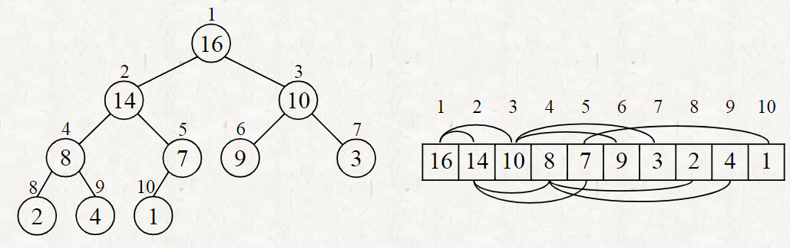

# Algorithms (ITE2039)

[TOC]

## Introduction

Midterm exam: 35% 10.24 7:00 PM

Final exam: 35% 12.19 7:00 PM

2 C++ homework: 20%

Attendance: 10%

Textbook: introduction to algorithm 3ed

## Course content

Data Structure

Algorithms

**Running Time**

**Space Consumption**

### Sorting Problem

#### Insertion Sort

Insert each key on a sorted list.

The running time of insertion sort: $Θ(n^2)$ on average

| Insertion Sort | Best Case | Average Case | Worst Case |
| -------------- | --------- | ------------ | ---------- |
|                | $Θ(n)$    | $Θ(n^2)$     | $Θ(n^2)$   |

#### Merge

Two sorted lists generate a sorted list.

##### Running Time & Steps

Divide: $Θ(1)$

Conquer: $2 \times T(n/2)$

Combine: $Θ(n)$

The height of recursion tree is $lg(n) +1$

The **Total Running Time** of merge short is $Θ(nlgn)$

### Analogy

**O-notation**: asymptotic upper bound

O(g(n)) 

**Ω-notation**: asymptotic lower bound

Ω(g(n))

**Θ-notation**: asymptotically tight bound

Θ(g(n))

**o-notation**: 

o(g(n))

f(n) is called asymptotically smaller than g(n)

**ω-notation**: 

f(n) is called an asymptotically larger than g(n)

### Transitivity

### Recurrences

#### substitution method

### Heapsort

#### Heaps

Heap is a nearly complete binary tree.

**PARENT(i)** 

​	return $\lfloor {\frac{i}{2}} \rfloor$

**LEFT(i)**

​	return $2i$

**RIGHT(i)**

​	return $2i + 1$

The height of a heap is $Θ(lgn)$

#### Maintaining the heap property

The running time of **MAX-HEAPIFY** 

* $T(n)$ where n is the number of nodes in the subtree.

* $Θ(1)$ time to exchange values 

* $O(h)$ = $O(lg n)$ time in total

#### Building a heap

**Running time** of building a heap is $O(nlgn)$ because each call to **MAX-HEAPIFY** costs $O(lg  n)$ time, and there are $O(n) $

**Insert** $O(lgn)$ time

### Quicksort

in partition it costs $Θ(n)$

$T(n) \leq Θ(nlgn)$

in Unbalanced partitioning, quicksort takes $O(n^2)$ time in **worst case**.

| Quicksort |      | Avg        | Worst     |
| --------- | ---- | ---------- | --------- |
|           |      | $ O(nlgn)$ | $O(n^2 )$ |

### Sorting in Linear Time

#### The decision-tree model

There are $n(n-1)(n-2)$ kinds situation

###  Dynamic Programming 

Dynamic programming is typically to solve **optimization problems**.

To find a solution with **the** optimal (minimum or maximum) value.

